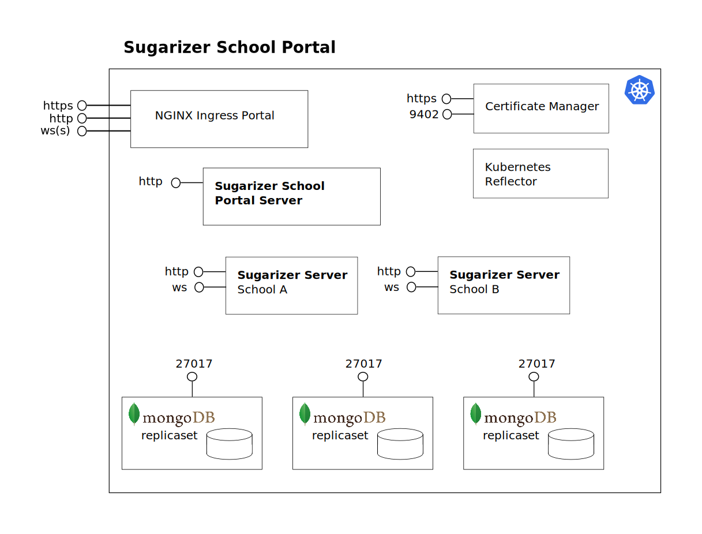

# Sugarizer School Portal Chart
[Helm](https://helm.sh/) Chart for setting up [Sugarizer School Portal Server](https://github.com/nikhilm98/sugarizer-school-portal-server) deployment on a [Kubernetes](https://kubernetes.io/) cluster.

[Sugarizer School Portal](https://github.com/nikhilm98/sugarizer-school-portal) is a Kubernetes cluster that is able to create/manage on-demand new Sugarizer Server instances. The following schema sum up the Sugarizer School Portal architecture.



## Usage
You can deploy **Sugarizer School Portal Server** instance by editing the values of the Values YAML file and running simple `helm install` command. The Sugarizer School Portal Server instance can be accessed by the browser by opening the hostName URL.

## Provider Support
Sugarizer School Portal Chart supports three providers:
- [Amazon Elastic Kubernetes Service](https://aws.amazon.com/eks/) (Amazon EKS)
- [Azure Kubernetes Service](https://azure.microsoft.com/en-in/services/kubernetes-service/) (AKS)
- [Google Kubernetes Engine](https://cloud.google.com/kubernetes-engine) (GKE)


**Note:**
- If you do not want to use HTTPS with Sugarizer School Portal, set `https` to `false` in `values.yaml`. The TLS Certificate will not be generated. You don't need to configure `cluster` in the `values.yaml` file in this case.
- If you want HTTPS then you need to set up Cloud DNS on your cloud provider and enter its  configuration in the `values.yaml` file.

## Setup Script (Automatic Setup)
You can use Sugarizer School Portal setup script to install dependencies, set-up the cluster environment and install the Sugarizer School Portal Chart on your AKS/EKS/GKE Cluster. You can find the script [here](https://github.com/NikhilM98/sugarizer-school-portal/tree/master/scripts).

Simply navigate into the scripts directory and run `sh setup.sh` to set up your cluster. You can read more about the setup process in the [documentation](https://github.com/NikhilM98/sugarizer-school-portal/blob/master/scripts/README.md).

## Environment Setup (Manual Setup)
If you don't have a cluster environment set-up, you can follow these steps to set-up a working environment.

### Install MongoDB Replicaset
You can install MongoDB Replicaset using [MongoDB Helm Chart](https://github.com/bitnami/charts/tree/master/bitnami/mongodb) packaged by Bitnami.
The chart can be installed by following these commands:
```bash
# Add Chart Repository
helm repo add bitnami https://charts.bitnami.com/bitnami
helm repo update

# Install the chart with the release name mymongodb (You can change the release name)
helm install ssp-mongodb bitnami/mongodb
```

### Install Kubernetes-Reflector
**Note:** Not required if you do not want HTTPS support.

[Reflector](https://github.com/emberstack/kubernetes-reflector) is a Kubernetes addon designed to monitor changes to resources (secrets and configmaps) and reflect changes to mirror resources in the same or other namespaces. Reflector includes a cert-manager extension used to automatically annotate created secrets and allow reflection.    
You can install Reflector using its Helm Chart. It can be installed by following these commands:
```bash
# Add Chart Repository
helm repo add emberstack https://emberstack.github.io/helm-charts
helm repo update

# Install the chart with the release name reflector (You can change the release name)
helm upgrade --install reflector emberstack/reflector
```

### Install NGINX Ingress Controller
The [NGINX Ingress Controller](https://github.com/nginxinc/kubernetes-ingress/) provides an implementation of an Ingress controller for NGINX and NGINX Plus.

The Ingress is a Kubernetes resource that lets you configure an HTTP load balancer for applications running on Kubernetes, represented by one or more Services. Such a load balancer is necessary to deliver those applications to clients outside of the Kubernetes cluster.

Clone the chart repository:
```bash
git clone https://github.com/nginxinc/kubernetes-ingress/
cd deployments/helm-chart/
```
Open the `values.yaml` file and add these `customPorts` under `controller.service.customPorts`:
```bash
# For HTTP only support (AKS/EKS/GKE/Microk8s)
customPorts:
  - port: 8039
    targetPort: http
    protocol: TCP
    name: presence
```
Or
```bash
# If you want to have HTTPS support (AKS/EKS/GKE + Cloud DNS)
customPorts:
  - port: 8039
    targetPort: https
    protocol: TCP
    name: presence
```

Install the chart with the release name nginx-ingress (You can change the release name)
```bash
helm install nginx-ingress .
```
After installing the controller, point the hosts (domain name) to the External IP of the NGINX Ingress Controller. You can find the External IP by running:
```bash
kubectl get service --all-namespaces
```
Point the `A` record of domain to the External IP of the controller.

### Install Cert-Manager
**Note:** Required if you want HTTPS support. You also need to set up Cloud DNS on your cloud provider and enter its configuration in the `values.yaml` file. Not required if you do not want HTTPS support.

[Cert-Manager](https://cert-manager.io/docs/) is a native Kubernetes certificate management controller. It can help with issuing certificates from a variety of sources, such as Let’s Encrypt, HashiCorp Vault, Venafi, a simple signing key pair, or self-signed.

We use Cert-Manager to issue HTTPS certificates to the Sugarizer School Portal Server and its Sugarizer-Server deployments.

You can refer to Cert-Manager [installation documentation](https://cert-manager.io/docs/installation/kubernetes/) or simply follow these commands to install Cert-Manager on the cluster:
```bash
# Create the namespace for cert-manager
kubectl create namespace cert-manager

# Add the Jetstack Helm repository
helm repo add jetstack https://charts.jetstack.io
helm repo update

# Cert-Manager requires a number of CRD resources to be installed into your cluster as part of installation.
# Install CRDs as part of the Helm release
helm install cert-manager jetstack/cert-manager --namespace cert-manager --version v0.15.1 --set installCRDs=true
```

### Create Service Account
**Note:** Required only if you want HTTPS support.

**Instructions:**
- **AKS:**
You need to create a Service Principal for Azure. You can follow these [instructions](https://cert-manager.io/docs/configuration/acme/dns01/azuredns/) to create a Service Principal for Azure.

**EKS:**
You need to use Amazon Route53 as Cloud DNS to allow certificate verification. You can follow these [instructions](https://cert-manager.io/docs/configuration/acme/dns01/route53/) to configure Route53 for AWS.

- **GKE:**
You can create a Service Account for GCP by following these [instructions](https://cert-manager.io/docs/configuration/acme/dns01/google/).
Save the service account key. It will be required in the values.yaml file while chart installation. It'll also be required if you set-up backup and restore using MGOB and intend to use gcloud bucket.

## Chart Installation (Manual Setup)
If you have Kubernetes set-up, then Sugarizer School Portal Chart can be installed by following these steps:

### Clone Sugarizer School Portal Chart
```bash
git clone https://github.com/NikhilM98/sugarizer-school-portal-chart
```
### Edit Default Values
Open [values.yaml](values.yaml) and edit the default values.

**[sspNamespace] -**
Kubernetes [Namespace](https://kubernetes.io/docs/concepts/overview/working-with-objects/namespaces/) for the chart. It is the namespace on which Sugarizer School Portal Server will be installed.

**[hostName] -**
The hostname from which Sugarizer School Portal Server will be accessible. Must be a valid domain/subdomain. Must be a valid hostname as defined in [RFC 1123](https://tools.ietf.org/html/rfc1123). The hostname should point towards the External IP of the NGINX Ingress controller.

**[deployment]**
- **host:** The host on which new Sugarizer-Server deployments will be available as subdomain. The Sugarizer-Server deployments will be available on `<schoolShortName>.host`. For example if schoolShortName is `test` and host is `sugarizer.tools` then the deployment will be available on `test.sugarizer.tools`.

- **https:** Boolean. Set it to `true` to enable HTTPS support.

- **production:** Boolean. Use to switch between letsencrypt Staging and Production server. Set it to `true` to switch to Production server.

**[database]**
- **databaseUrl:** The URL of the MongoDB database. If replicaset is used, it can be the name of your replicaset like `mymongodb` which maps to `mymongodb-mongodb-replicaset-0.mymongodb-mongodb-replicaset.default.svc.cluster.local:27017,mymongodb-mongodb-replicaset-1.mymongodb-mongodb-replicaset.default.svc.cluster.local:27017,mymongodb-mongodb-replicaset-2.mymongodb-mongodb-replicaset.default.svc.cluster.local:27017` in the .ini file or if a single database without replicaset is used, then it can be like `sugarizer-service-db-mymongodb.sugarizer-mymongodb.svc.cluster.local`.

- **replicaset:** Boolean. Defines if databaseUrl is the URL of a replicaset or a single database. Set it to `true` if MongoDB replicaset chart is used. `false` if database is used without replicasets.

**[cluster]**: Not required if HTTPS is `false`.
- **provider:** The provider on which cluster is hosted on. Options: `gke`, `azure`, `aws`.

*If the provider is `gke`:*
- **gcpProjectId:** The Project ID of the project on Google Cloud Platform.
- **gcpServiceAccount:** Your GCP Service Account key in base64 format.

*If the provider is `azure`:*
- **azureClientSecret:** Your Azure Service Principal Password in plain text format.
- **azureSPAppId:** Your Azure Service Principal App ID.
- **azureSubscriptionId:** The Subscription ID of your Azure Cloud Platform Account.
- **azureTenantId:** The Tenant ID for your Azure Service Principal.
- **azureDnsZoneResourceGroup:** The Resource Group that you have your DNZ Zone in.
- **azureDnsZone:** The name of your Azure DNS Zone.

*If the provider is `aws`:*
- **awsClientSecret:**  Your AWS Secret Access Key in plain text format.
- **awsRegion:**  The region on which your DNS Zone is hosted on.
- **awsAccessKeyId:** Your AWS Access Key ID.
- **awsDnsZone:** The name of your AWS DNS Zone.
- **awsRole:** (Optional Dependency) The Role attached to your account.

**[verification]**: Optional. Whether Client Email Validation through SMTP will be enabled or not.
- **enabled:** Boolean. Defines if verification will be enabled or not.
- **smtpPort:** The port number of SMTP Server.
- **smtpHost:** The host URL of SMTP Server.
- **smtpTlsSsecure:** Boolean. Is SMTP TLS Secure or not.
- **smtpUser:** The username of your SMTP server.
- **smtpPass:** The password of your SMTP server.
- **smtpEmail:** The email address that will be used to send emails.

**[webhook]**: Optional.
- **slackWebhookUrl:** The [slackWebhookUrl](https://api.slack.com/messaging/webhooks) of your slack channel to connect the server with the webhook. You can follow [these](https://api.slack.com/messaging/webhooks#getting_started) instructions to create a webhook. Set `slackWebhookUrl` to `false` if you do not want your app to connect with Slack. If the app is connected with slack, it'll send notifications to the channel if a deployment is created or destroyed.

**[security]**: The security parameters of your deployment. Recommended default values are provided. You can change some of them if you want to.
- **minPassSize:** The integer value for the minimum number of characters of the password.
- **maxAge:** The maxAge is the expiration time in milliseconds of a session with the client. At the expiration of the session, the client should reenter its password. The default time is 172800000 (48 hours).
- **maxAgeTfa:** The maxAgeTfa is the expiration time in milliseconds of a session with the client. At the expiration of the session, the client should reenter its password. The default time is 180000 (30 mins).
- **serviceName:** The issuer parameter is a string value indicating the provider or service this account is associated with, URL-encoded according to [RFC 3986](http://tools.ietf.org/html/rfc3986).
- **secret:** The JWT Secret which is used to encrypt JSON Web Token. It should be replaced with a unique value to keep the SSP Server secure.

### Install Chart Using Helm
Navigate into the chart directory and run:
```bash
helm install ssp .
```
Where `ssp` can be the name you want to give to this chart.

## Backup and Restore data using MGOB
You can implement backup and restore feature on the Sugarizer School Portal MongoDB replicaset by using MGOB.
[MGOB](https://github.com/stefanprodan/mgob/) is a MongoDB backup automation tool built with Go. It features like scheduled backups, local backups retention, upload to S3 Object Storage (Minio, AWS, Google Cloud, Azure) and upload to gcloud storage.

To setup MGOB to automate MongoDB backups on Google Kubernetes Engine, you can follow this [documentation](https://github.com/nikhilm98/sugarizer-school-portal#backup-and-restore-data-using-mgob).

## Contributing
Pull requests are welcome. For major changes, please open an issue first to discuss what you would like to change.

## License
This project is licensed under `Apache v2` License. See [LICENSE](LICENSE) for full license text.

[](https://opensource.org/licenses/Apache-2.0)
